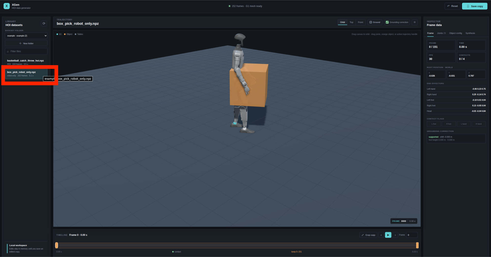
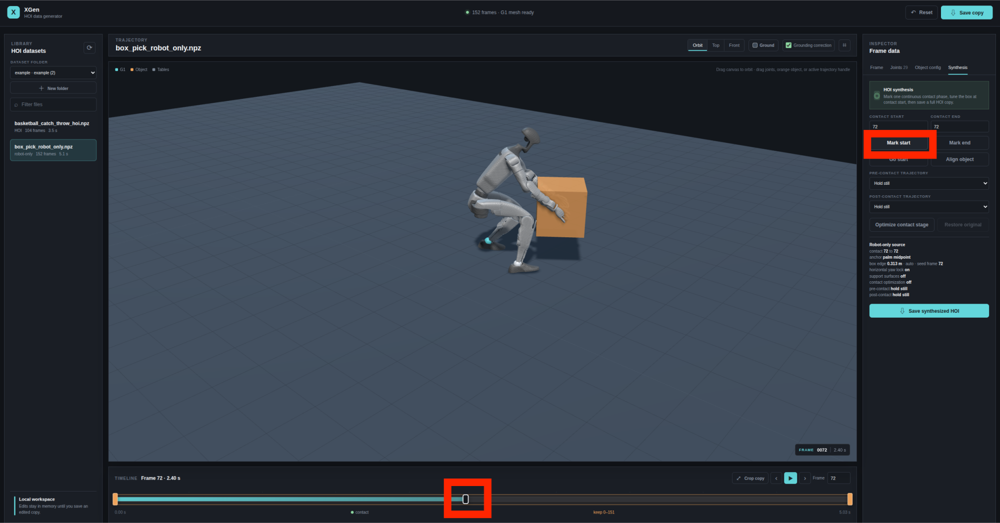
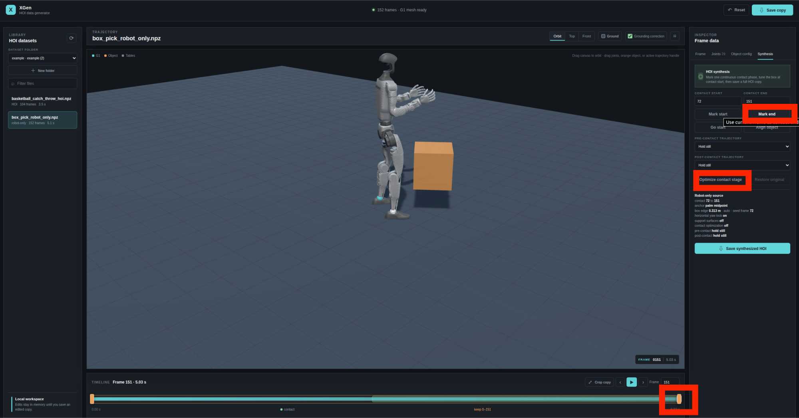
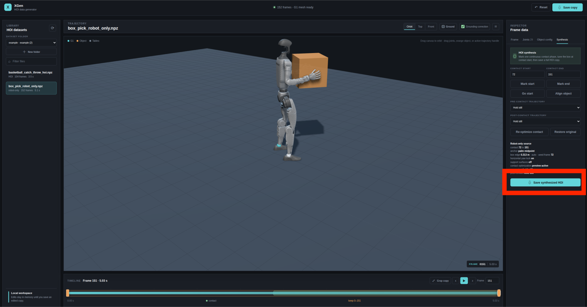

# XGen

XGen is a lightweight web-based tool for synthesizing and editing human-object
interaction (HOI) motion data. It takes robot motion as input and provides an
interactive workflow for defining object contact, optimizing hand-object
alignment, and exporting complete HOI trajectories.

This page provides a quick start guide. For the full feature reference,
supported data formats, editing options, and conversion utilities, see
[`README_details.md`](README_details.md).

## Role in the Video-to-HOI Pipeline

For a video-to-HOI workflow, the typical pipeline is:

1. [GVHMR](https://github.com/zju3dv/GVHMR): estimate human motion from video;
2. [UMR](https://github.com/hanyang9/UMR): retarget human motion to robot motion;
3. **XGen**: synthesize and edit HOI data from the robot motion.

This quick start assumes that robot motion has already been prepared. The
repository includes [`data/example/box_pick_robot_only.npz`](data/example/box_pick_robot_only.npz)
as an example input.

## 🥳 Quick Start
### Installation

From the `xgen` directory, install the required Python packages:

```bash
python -m pip install numpy mujoco joblib
```

XGen requires Python 3 and a desktop browser with WebGL support. No Node.js
installation or frontend build step is required.

### Launch XGen

From the `xgen` directory, run:

```bash
bash xgen_editor/run_hoi_editor.sh --port 8766
```

Then open the following address in a browser:

```text
http://127.0.0.1:8766
```

The editor uses `xgen/data/` as its default data directory. You can place
additional `.npz` files in a subdirectory under `data/`; dataset folders are
available from the editor's folder selector.

### Basic HOI Synthesis Workflow

1. Select a robot motion file, such as
   `data/example/box_pick_robot_only.npz`.
   
2. Mark the frame where the contact stage begins.
   
3. Mark the contact end frame and click **Optimize contact stage**.
   
4. Configure the object if needed, then save the synthesized HOI data.
   

XGen does not overwrite the source motion. Exported files are saved as new
`.npz` files in the currently selected dataset folder.

For more advanced editing, including object configuration, grounding
correction, parabolic trajectories, trajectory cropping, and data conversion,
see [`README_details.md`](README_details.md).

## Batch Synthesis with LLM Agents

When many robot motion files share a similar interaction pattern, an LLM agent
can use XGen to batch-process them. For example:

> The folder `data/box_pick_robot_only/` contains robot motion files for
> box-picking actions. Use XGen's default configuration to synthesize HOI data:
> mark the contact start and end frames, run contact optimization, and save the
> results as HOI `.npz` files.

For reliable batch processing, specify the input folder, the intended
interaction pattern, the contact-stage behavior, and the output folder in the
prompt.
